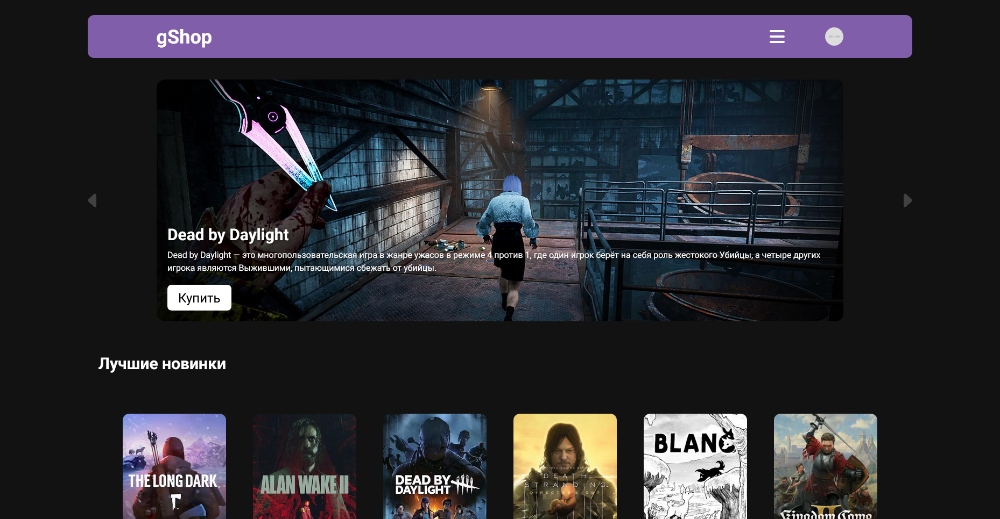
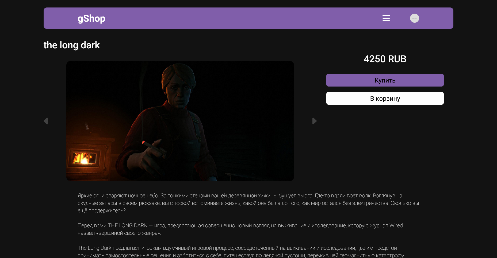
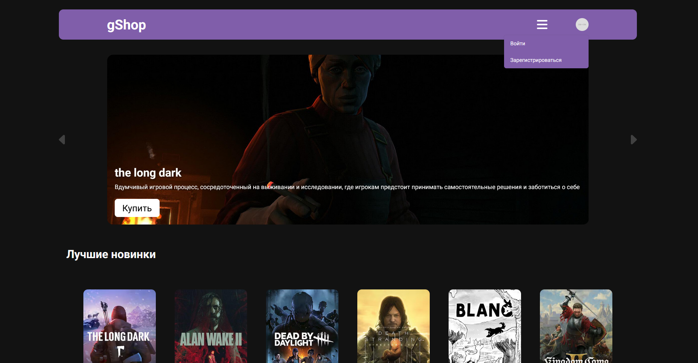
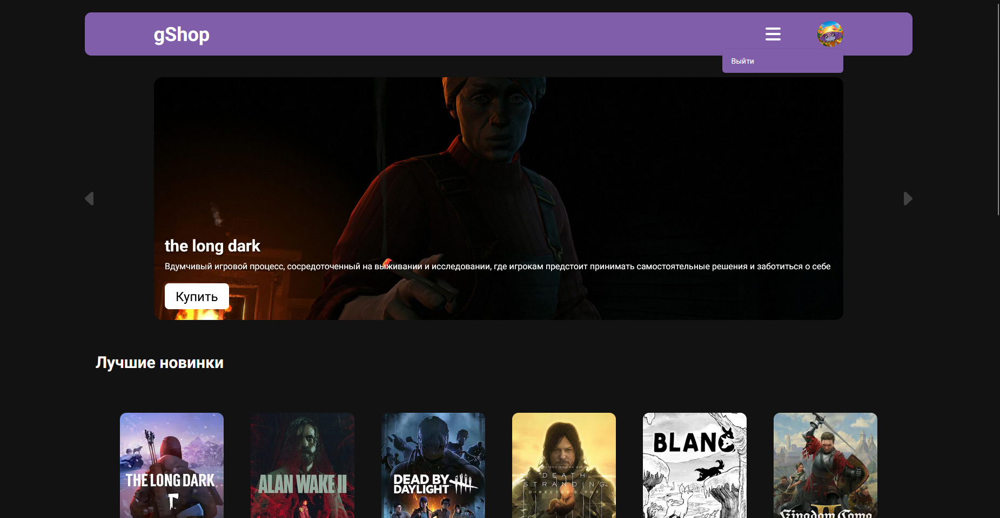
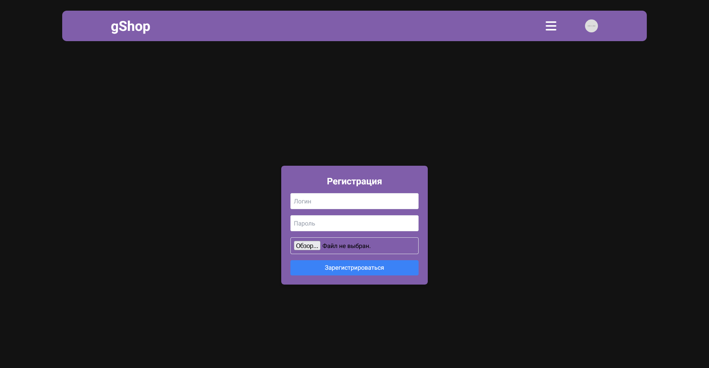
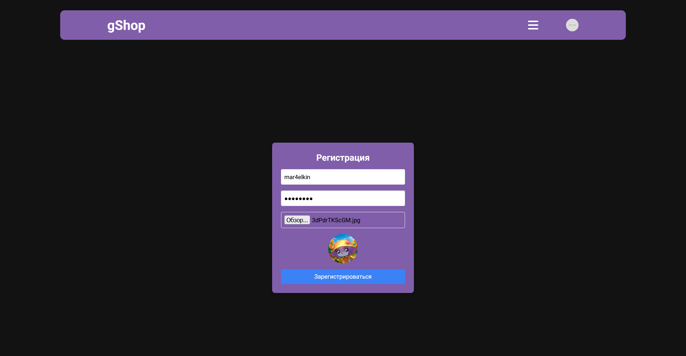
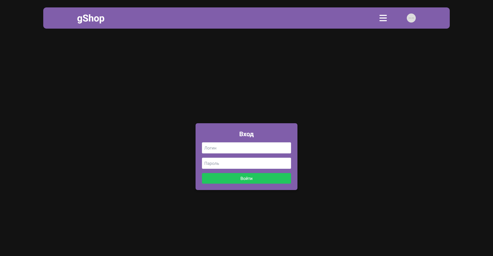
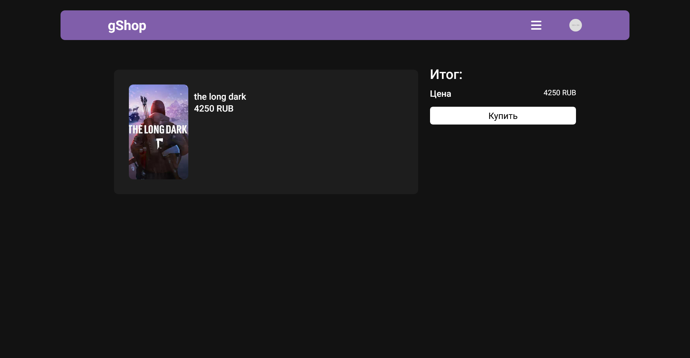

# Проект

Этот проект создан в учебных целях в рамках курса "Дисциплина: Web-технологии" в Университете ГУАП

## Требования

1) Создание web – сайта посредством языка разметки HTML и языка стилей CSS (сделанно используя React/Next.js).
2) Создание базы данных и настройка OpenServer (вместо этого использовался Docker и MongoDB).
3) Подключение базы данных к Web - сайту (сделано через MongoDB C++ driver).
4) Создание выпадающего меню и слайдера изображений (реализовано с использованием нативных компонентов React/Next.js).

## Результат











## Сборка

## docker
```sh
docker-compose build
docker-compose up # придеться собрать backend отдельно
``` 

## Frontend

```sh
npm install # или yarn install
```

## Backend

### Установка Crow

```sh
git clone https://github.com/CrowCpp/Crow.git
```

#### Установка зависимостей Crow

```sh
sudo apt install cmake g++ libboost-all-dev libssl-dev
sudo apt-get install libasio-dev
```

#### Сборка и установка Crow

```sh
cmake .. -DCROW_BUILD_EXAMPLES=OFF -DCROW_BUILD_TESTS=OFF
sudo make install .
```

### Установка MongoDB C++ драйвера

```sh
curl -OL https://github.com/mongodb/mongo-cxx-driver/releases/download/r4.0.0/mongo-cxx-driver-r4.0.0.tar.gz
tar -xzf mongo-cxx-driver-r4.0.0.tar.gz
cd mongo-cxx-driver-r4.0.0/build
```

#### Сборка и установка MongoDB C++ драйвера

```sh
cmake ..                                \
    -DCMAKE_BUILD_TYPE=Release          \
    -DCMAKE_CXX_STANDARD=20

cmake --build .
sudo cmake --build . --target install
```

### Установка stb_image

```sh
mkdir stb
cd stb
wget https://raw.githubusercontent.com/nothings/stb/master/stb_image.h
wget https://raw.githubusercontent.com/nothings/stb/master/stb_image_write.h
```

